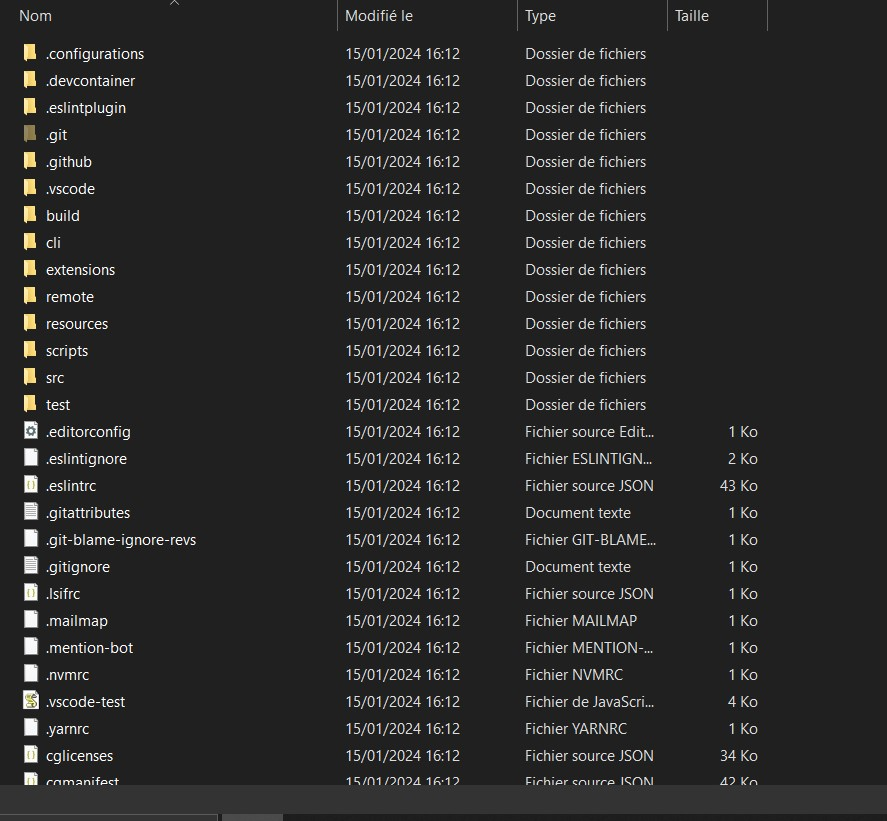
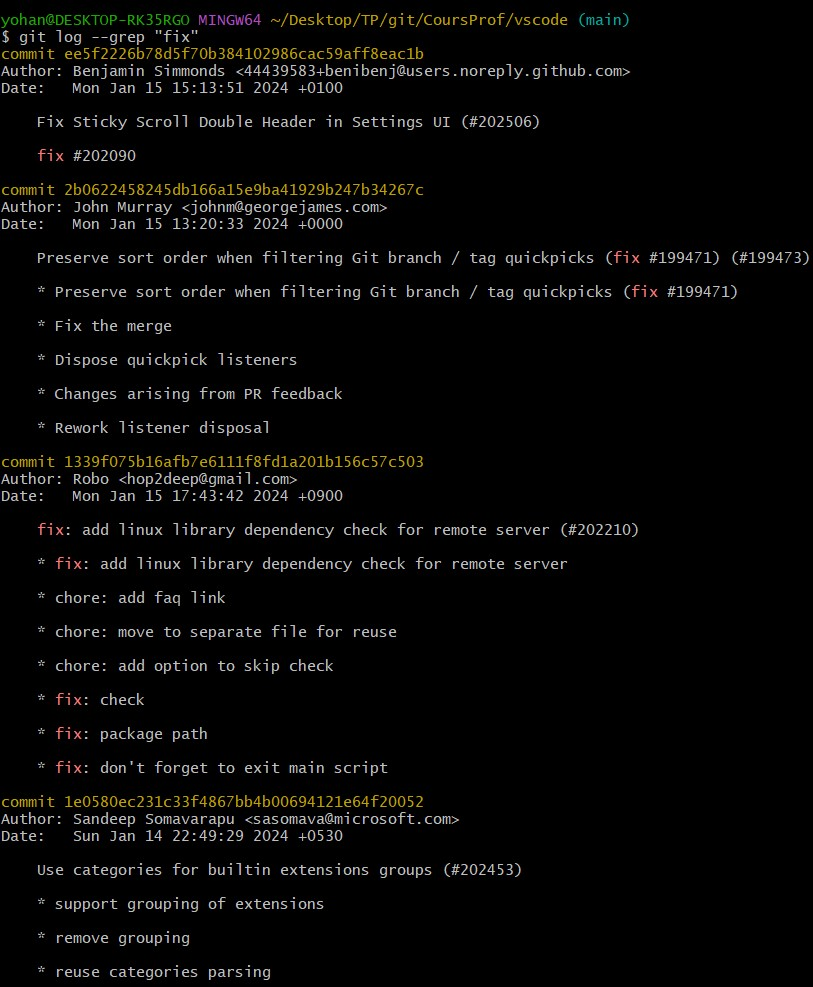
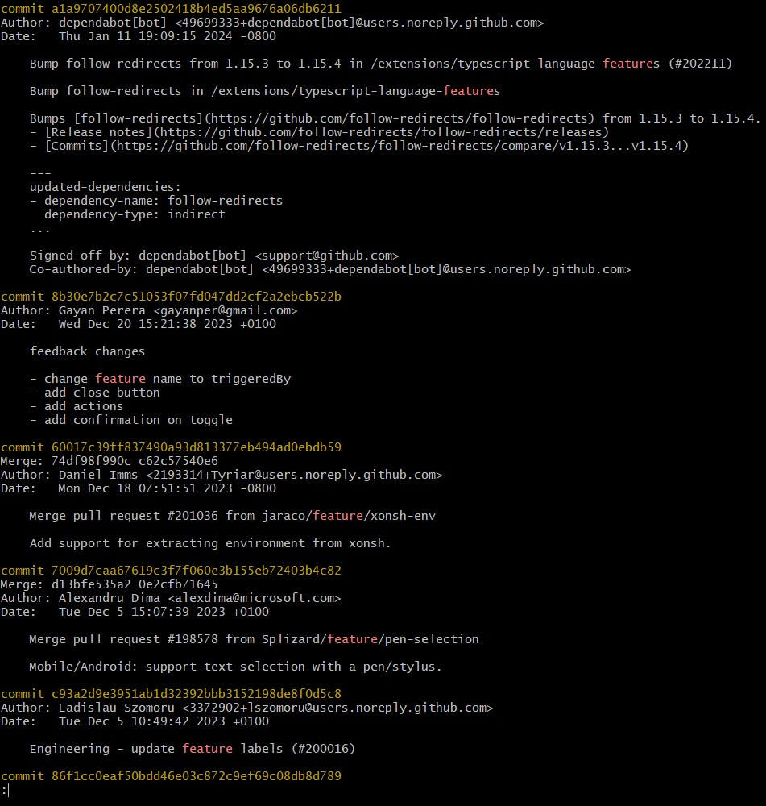
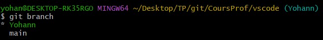
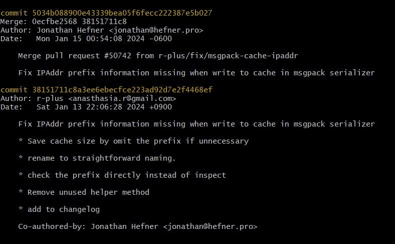

# TP 1: Introduction et Bases de Git 

#### Question 1 :



Le dépôt a bien été cloné

#### Question 2 :

en utilisant la commande suivante :
```sh
git log --grep "fix"

```

on peut avoir accès à l'historique des commit de bug fixes :



on peut avoir accès à l'historique des commit de feature :



#### Question 3 :

Pour crée une branche l faut utiliser la commande :

```sh
git branch 'Yohann'
```

On se positionne ensuite sur la bonne branche avec la commande :

```sh
git checkout 'Yohann'
```


Nous sommes bien sur la bonne branche.

# TP 2: Bonnes Pratiques de Codage

### Question 1 :



dans ces commits on voit deux fois la même ligne 
"_Fix IPAddr prefix information missing when write to cache in msgpack serializer_"

on pourrait croire le le bug a été régler deux fois.

### Question 2 :


